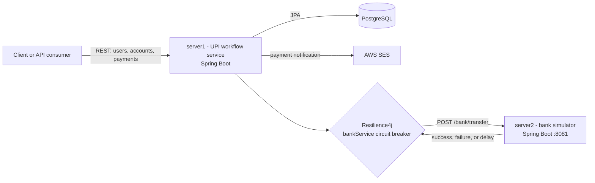

# UPI_WORKFLOW

A two-service Spring Boot demonstration of a UPI-style payment workflow and a Resilience4j circuit breaker protecting calls to a bank service.

## Architecture



### server1

The main application owns users, bank accounts, and transactions. Its controllers accept client requests, its services apply payment rules, and its repositories persist entities through Spring Data JPA. It also sends transaction notifications through AWS SES.

### server2

The bank service exposes `POST /bank/transfer`. It deliberately simulates three outcomes: a successful response, a failed request, or a delayed response. These outcomes make it possible to observe the circuit breaker during local testing.

## How the payment workflow works

### Synchronous payment: `POST /pay`

1. The client sends `senderAccountNumber`, `receiverAccountNumber`, and `amount` to `server1`.
2. `server1` loads both accounts from PostgreSQL and rejects missing accounts, identical accounts, or insufficient balance.
3. Before changing balances, `server1` calls `server2` through `RestTemplate` and the `bankService` circuit breaker.
4. If the bank call succeeds, the sender balance is reduced, the receiver balance is increased, and the transaction is saved as `SUCCESS`.
5. If the bank call fails or the circuit is open, the fallback raises an error and the payment does not complete.

### Concurrent payment test: `POST /payAsync`

`/payAsync` submits four payment attempts to a fixed thread pool. Each attempt uses the same transaction logic and retries up to three times when an optimistic-locking conflict occurs. Successful or failed results can trigger asynchronous email notifications through AWS SES.

### Circuit-breaker behavior

The `bankService` circuit breaker uses a count-based window of five calls and opens when the failure rate reaches 50 percent. Once open, calls are rejected through the fallback instead of continuing to call the bank service. After the configured 10-second open period, two half-open calls are permitted to test recovery.

### Bank simulator behavior

`server2` chooses its response randomly:

- Below 50 percent: returns `Bank Transfer Successful`.
- From 50 percent to below 90 percent: throws a simulated transfer failure.
- From 90 percent upward: waits 10 seconds, then returns success.

## Repository layout

```text
server1/demo   Payment, user, transaction, and notification service
server2/demo   Simulated bank service
```

## Main endpoints

| Service | Method | Endpoint | Purpose |
| --- | --- | --- | --- |
| server1 | `GET` | `/hello` | Health-style greeting |
| server1 | `POST` | `/createUser` | Create a user |
| server1 | `POST` | `/createBankAccount` | Create an account for a user |
| server1 | `GET` | `/checkBalance` | Read an account balance |
| server1 | `POST` | `/pay` | Execute one payment |
| server1 | `POST` | `/payAsync` | Execute four concurrent payment attempts |
| server2 | `POST` | `/bank/transfer` | Simulate a bank transfer |

## Safe local setup

1. Copy `server1/demo/src/main/resources/application.properties.example` to `application.properties` and fill in local values.
2. Copy `server2/demo/src/main/resources/application.properties.example` to `application.properties` and fill in local values.
3. Configure AWS SES using the AWS SDK credential provider chain, for example an AWS CLI profile or environment variables set outside the repository.
4. Start `server2` before exercising payment calls from `server1`.

Live `application.properties`, `.env` files, credentials, private keys, and build output are ignored by Git. Review `git status` and `git diff --cached` before every push.

## Credential safety

Do not commit passwords, database URLs containing credentials, AWS access keys, tokens, or private keys. The original local credentials must be rotated or revoked before publishing this repository because they have been exposed during development. Remove any compromised AWS access key and secret, rotate the database password, and update local configuration with the replacement values.

## Run

From each service directory:

```bash
./mvnw spring-boot:run
```

On Windows, use `mvnw.cmd spring-boot:run`.

## License

No license has been selected for this project yet.